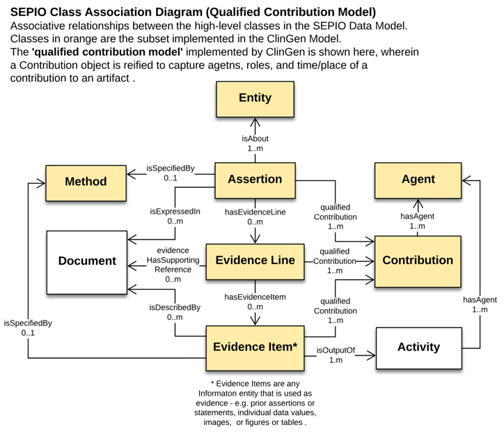

##Introduction

An interpretation is the outcome of structured reasoning applied to evidence.   Interpretations may be made about many kinds of entities using many kinds of evidence, and different formalized reasoning strategies.  We've seen in [Getting Started](getting_started.html) how a variant pathogenicity interpretation can be structured as a chain of conclusions based on evidence, including possibly other supported conclusions.  We believe that this is a general structure for the interpretation of evidence, and we want our model to reflect this generality, so that we will be able to apply the same basic model to a wide variety of situations such as gene-disease curation, gene actionability, interpretation of somatic variants, and so on.

##SEPIO

The interpretation model requires a structure describing the relationship between a conclusion and the evidence that led to this conclusion;  the Scientific Evidence and Provenance Information Ontology ([SEPIO](./sepio.html)) provides such a structure.  In SEPIO, an [assertion](https://github.com/monarch-initiative/SEPIO-ontology/wiki/Assertion){:target="sepioassertion"} is the conclusion drawn from reasoning about [Evidence Items](https://github.com/monarch-initiative/SEPIO-ontology/wiki/Evidence-Item){:target="sepioevidenceitem"}.   This information can be either data, like an allele frequency, or a prior assertion.



This ability for one SEPIO assertion to support another is integral to our use of SEPIO.   A VariantInterpretation is a SEPIO assertion, and it is supported by a CriteriaAssessment, which is also a ClinVar assertion. This CriteriaAssessment is, in turn, supported by measured data.  In other words, the data is used to create an intermediate assertion: a CriteriaAssessment saying that, for example, BA1 is satisfied for this variant.   This CriteriaAssessment (and potentially other such CriteriaAssessments) are then used to create the final VariantInterpretation in a second cycle of the basic SEPIO model.


##Evidence Lines

In the ClinGen interpretation model, as well as in SEPIO, assertions are not directly linked to their underlying evidence.  Rather, this link is mediated by an EvidenceLine node.  These nodes serve two purposes: First, they are structural nodes used to combine multiple individually-coded evidence statements that should be considered together.  Second, properties of EvidenceLines can be used for values that are not specific to the assertion or the supporting data, but to the relationship between them.

In the ClinGen interpretation model,  one such property is the strength with which a CriteriaAssessment supports an Interpretation.  When an expert applies a criteria, they may find that a particular criteria is satisfied by a given set of data.   The particular criteria (such as PS1 or BP2) has a default strength describing how much weight should be given to this finding in creating the overall interpretation.  However, the expert analyst may override the default and find that in the case of this interpretation, this assessment may be judged to have increased or decreased strength.  This strength, then, is a property of the EvidenceLine, because it is a property of how much the assessment is used in the context of this specific interpretation.

##Contributions

In addition to capturing the structure of interpretation arguments, the model captures granular statements about the provenance of particular entities.   Interpretations, Assessments, EvidenceLines, and Statements can each be tagged with a Contribution, defining **when** the entity was created it and **who** created it, along with the **role** in which they were acting.

With this approach, multiple agents, both human and computational, can be noted as contributing to a specific element in a document, and different agents can be assigned as contributing to different precisely defined aspects of creating an interpretation.

##Model Structure

The following diagram displays the structure of a variant interpretation message.  An interpretation is essentially two cycles of the base SEPIO model.  First, an interpretation is supported by Criteria Assessments. Second, each Criteria Assessment is supported by Statements (usually Evidence Items).


At each stage, the conclusions and evidence lines can be tagged with Contributions tracking provenance.  Furthermore, each assertion (the interpretation and the assessment) can both indicate the pre-specified rule by which they were created.  Information about the strength of support that evidence lends to a conclusion is attached to the evidence line between them.

##JSON-LD and SEPIO Mapping

The native encoding of ClinGen interpretations is JSON-LD.  In particular, instances of classes in the interpretation model are expressed as JSON objects with types matching the name of the class.  Property names in the model appear in the JSON-LD serialization as keys.   In JSON-LD, a context file specifies IRIs for types and properties so that they can be unambiguously interpreted.

Many terms needed for variant pathogenicity interpretations were previously defined SEPIO. Variant pathogenicity interpretations also require specialized data elements related to specific types of entities (Alleles, Genes) or evidence (Segregation, Allele Frequencies).  In addition, ClinGen interpretations define new subclasses on SEPIO classes, such as distinguishing VariantInterpretations from CriteriaAssessments.  Each is a SEPIO interpretation, but with different properties. These terms do not make sense to add to the core SEPIO product, but have been added to ClinGen-specific extensions within the SEPIO project which are jointly maintained by the Monarch and ClinGen projects.

For instance, the lines in the [ClinGen interpretation context](http://datamodel.clinicalgenome.org/interpretation/json/context)

``` "VariantInterpretation": {
   "@id": "SEPIO:0000190"
},
```
indicate that a VariantInterpretation in a ClinGen JSON-LD document is the same entity as the type defined by the id SEPIO:0000190. That SEPIO id is defined in the [ClinGen-specific SEPIO extension here](https://github.com/monarch-initiative/SEPIO-ontology/blob/master/src/ontology/extensions/sepio-clingen.owl){:target="sepio"} as a variant pathogenicity interpretation, which is a subclass of SEPIO:0000001.  SEPIO:0000001 can be found in the [main SEPIO OWL file](https://raw.githubusercontent.com/monarch-initiative/SEPIO-ontology/master/src/ontology/sepio.owl){:target="sepio"}, where it is defined as an [Assertion](http://github.com/monarch-initiative/SEPIO-ontology/wiki/Assertion){:target="sepio"} in SEPIO.


##Further Information

This document has described the connection to the SEPIO model and the detailed structure of a message.   For details of the individual classes see the [Class Documentation](/tech).  For implementation topics, see the [FAQ](faq.html).
