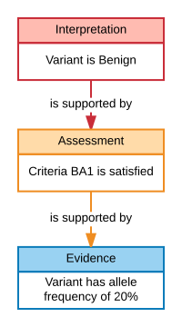

This guide provides background, use cases, examples, future planning and
collaborations surrounding ClinGen's Variant Interpretation Model. This portion
of the documentation is targeted at the health care providers, scientists,
geneticists, counselors, and researchers that work in or are interested in
curating and interpreting variants.

##Introduction

An interpretation is the outcome of structured reasoning applied to evidence.   Interpretations may be made about many kinds of entities using many kinds of evidence, and different formalized reasoning strategies.  Although the overall structure of an interpretation is the same for many cases, the initial version of the interpretation model is limited to interpretations on the pathogenicity of sequence variants made using the [ACMG Pathogenicity Guidelines](http://www.nature.com/gim/journal/v17/n5/full/gim201530a.html){:target="acmgguidelines"}.   The discussion below will specifically use this context as an example, but the structure of the model is expected to remain largely unchanged as new interpretation contexts are added.

####The process of generating this type of interpretation is composed of three kinds of activities:

1. Collection of **evidence** from potentially many sources such as literature or databases.
2. Application of individual **ACMG Guideline Criteria** to the gathered evidence to produce **assessments** about whether individual criteria are satisfied by the evidence.
3. Combination of these assertions to create an overall **interpretation** of the evidence: a statement about the pathogenicity of a given allele.

The outcome of this process is visualized as a tree.  The root node of the tree (the root of the JSON document) is the **interpretation**, and it draws upon the conclusions or **assessments** of individual ACMG criteria, and those in turn depend on the **evidence** (the leaves of the tree).

An interpretation without the supporting evidence and reasoning is merely an assertion.  Inclusion of the evidence and reasoning allows the receiver to draw their own conclusions, and to reasonably build upon the work carried out by an interpretations original creators.

The model is loosely coupled; individual entities (assertions or primary data elements) have at least a conceptual existence outside a given interpretation, so that the same piece of evidence that is generated for one interpretation may be retained, along with its provenance, and used in later interpretations.  

The tree structure of the model is collapsible.  If a user is interested only in the final interpretation, they need to simply access the root node of the structure.  Suppose however, that a user has a discrepant interpretation.  The initial question in such a case would be "which ACMG criteria were used to generate the interpretation?"  The user can answer this question by moving one level in the graph to see which lines of evidence were used by the interpretation.  Suppose further that most of these assessments concur with the users' but that one is not.  Then the user may inspect the branch of the tree corresponding to that conflicting assessment, allowing inspection of the particular evidence and where that evidence came from.

##SEPIO

The interpretation model requires a structure describing the relationship between a conclusion and the evidence that led to this conclusion;  the Scientific Evidence and Provenance Information Ontology ([SEPIO](./sepio.html)) provides such a structure.  In SEPIO, an [assertion](https://github.com/monarch-initiative/SEPIO-ontology/wiki/Assertion){:target="sepioassertion"} is the conclusion drawn from reasoning about [information](https://github.com/monarch-initiative/SEPIO-ontology/wiki/Evidence-Item){:target="sepioevidenceitem"}.   This information can be either data, like an allele frequency, or a prior assertion.

[comment]: # (Larry's SEPIO/ClinGen diagram here.   We can add more text once we see the figure, but the words below should be close.)

The ability for one SEPIO assertion to support another is the key in how we use SEPIO to structure our interpretation documents.   A VariantInterpretation is a SEPIO assertion, and it is supported by a CriteriaAssessment, which is also a ClinVar assertion. This CriteriaAssessment is, in turn, supported by measured data.  In other words, the data is used to create an intermediate assertion: a CriteriaAssessment saying that, for example, BA1 is satisfied for this variant.   This CriteriaAssessment (and potentially other such CriteriaAssessments) are then used to create the final VariantInterpretation in a second cycle of the basic SEPIO model.

##Evidence Lines

In the ClinGen interpretation model, as well as in SEPIO, assertions are not directly linked to their underlying evidence.  Rather, this link is mediated by an EvidenceLine node.  These nodes serve two purposes: First, they are structural nodes used as an umbrella to combine multiple individually-coded evidence statements that should be considered together.  Second, properties of EvidenceLines can be used for values that are not specific to the assertion or the supporting data, but to the relationship between them.

In the ClinGen interpretation model,  one such property is the strength with which a CriteriaAssessment supports an Interpretation.  When an expert applies a criteria, they may find that a particular criteria is satisfied by a given set of data.   The particular criteria (such as PS1 or BP2) has a default strength describing how much weight should be given to this finding in creating the overall interpretation.  However, the expert analyst may override the default and find that in the case of this interpretation, this assessment may be judged to have increased or decreased strength.  This strength, then, is a property of the EvidenceLine, because it is a property of how much the assessment is used in the context of this specific interpretation.

##Contributions

In addition to capturing the structure of interpretation arguments, the model captures granular statements about the provenance of particular entities.   Interpretations, Assessments, EvidenceLines, and Statements can each be tagged with a Contribution, defining **when** the entity was created it and **who** created it, along with the **role** in which they were acting.

With this approach, multiple agents, both human and computational, can be noted as contributing to a specific element in a document, and different agents can be assigned as contributing to different precisely defined aspects of creating an interpretation.

##JSON-LD

The native encoding of ClinGen interpretations is JSON-LD.  In particular, instances of classes in the interpretation model are expressed as JSON objects with types matching the name of the class.  Property names in the model appear in the JSON-LD serialization as keys.  

##Further Reading

The user guide for the ClinGen model contains information about [SEPIO](sepio.html) and [Projects](projects.html) that either aid authoring of the ClinGen interpretation model or depend on the model.

The [technical reference](../tech) contains specifications of the classes and properties in which the model is expressed.

The [examples]() in the documentation are a large set of JSON-LD documents and snippets that explain

1. How each class is used.
2. How the assessment of ACMG criteria may be expressed.
3. How all of the entities fit together to create a complete interpretation document.

The [SEPIO documentation](https://github.com/monarch-initiative/SEPIO-ontology/wiki){:target="sepio"} describes the generic use of the SEPIO ontology.
